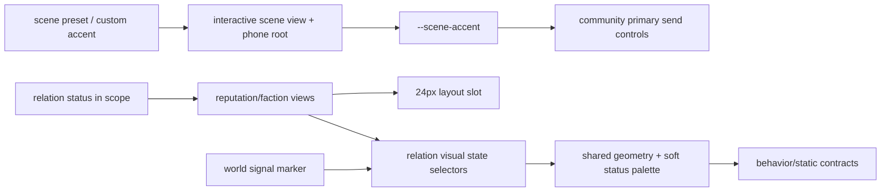

# 社区发送键与今日态势关系模块视觉收敛

## 1. 目标、边界与已确认事实

### 目标

1. 社区内发送动作使用当前子社区的 `--scene-accent`，不回退或泄漏到全局 `--pm-color-accent`。
2. 个人风评与势力图谱的可见关系圆，在起始列、24px 可见尺寸、SVG 尺寸、标题间距与世界态势 signal marker 对齐。
3. 两个关系模块的标题到说明收敛为明确的 8px 节奏，消除透明卡片内层 padding 和默认段落 margin 造成的错位。
4. 将关系状态改成低饱和、可区分的五档局部语义色，所有关系 SVG 统一为白色 `currentColor` 前景；不再让 warning/neutral 落到黑色线条。

### 已确认事实

- 社区 feed 发布与 live 弹幕发送复用 `.pm-scene-primary`；帖子评论的“发送回复”目前是独立按钮，必须一并纳入，否则所谓“社区发送键”只修一半，太敷衍。
- 场景根已有 `--scene-accent`，并由场景 preset/custom accent 的运行时链路更新；它是正确色源。不得修改桌面入口、普通聊天发送键或全局 accent。
- 世界态势 marker 是直接参与标题行布局的 24px 槽位（`--pm-today-trend-relation-node-size`）+ 18px SVG + `--pm-space-2` gap。
- 个人风评/势力图谱在普通模式已有 24px 可见圆；但极简模式把 44px button 本身放进 flex 行，令标题起点比世界态势额外右移。两个透明条目又各自有 12px 内层 padding，造成左缘和世界态势不一致。
- 极简关系状态当前使用 `danger/warning/surface/accent/success` 及各自 `on-*` 前景；其中 warning 与 neutral 合法地是黑色前景，因此会出现助手指出的突兀黑线。这不是 SVG 资产故障，而是颜色职责错误。

### 不做

- 不改 today-trend 数据模型、关系状态枚举、store、版本、生成 prompt、备份、导入导出或 title 图标映射。
- 不重画关系 SVG、不写行内颜色、不使用第三方图标、不将状态色写入数据。
- 不改变关系循环操作、菜单、meter、屏幕阅读标签、disabled 行为和键盘焦点语义。
- 不将社区色泄漏到 desktop app、普通手机聊天发送键、quick reply 或全局 `--pm-color-accent`。

## 2. 设计决策

### 2.1 社区发送色只在场景范围消费

为所有“提交用户在当前社区产生内容”的按钮建立同一 CSS 钩子：feed 发布、live 弹幕、帖子评论回复。其背景与边框消费 `--scene-accent`，前景保留现有 `--pm-color-on-dark`；hover/active 只通过既有表面/边框或受控明度路径表达，disabled 继续使用 `--pm-opacity-disabled`，focus-visible 继续使用全局 focus-ring。

场景 root 之外不得匹配该规则。`--scene-accent` 来自当前 scene preset/custom accent，因而自定义社区主题也自然生效；不新建平行社区配色配置。

### 2.2 关系节点：视觉槽位与触控槽位分离

新增一个仅承担布局的 24px relation slot，作为个人风评和势力图谱标题行的直接子项：

```text
[24px relation slot] -- 8px -- [title]
```

- 普通模式：slot 直接承载 24px 状态圆和 18px SVG。
- 极简模式：slot 仍只占 24px；其内部 44px button 绝对定位并向左扩展，使右边缘与可见圆槽位对齐，避免侵占标题列。button 内部只承载 24px 视觉圆。
- 这样 44px 仍是可触控、可聚焦的真实 button，不用 margin/scale 伪造命中区；标题起点则和世界态势的 `24 + 8` 结构一致。
- 组件根与卡片均不得 `overflow:hidden` 截断该命中区；实现前必须复核嵌套势力在 320px 下的命中与换行。

普通和极简模式都在 relation visual 元素上输出现有 `data-status`；属性来自既有内存 status，仅供 CSS 选择器使用，不写入持久化资料。

### 2.3 左缘与正文节奏统一

个人风评 entry 与 faction card 目前没有可见卡片表面，却保留独立 `padding`，因此首个圆的起点比世界态势多一层缩进。收敛方案：

- 去除无视觉价值的 entry/card 内层 padding；模块统一外层 padding 继续保留。
- 标题行统一 `align-items:center; gap:var(--pm-space-2)`。
- entry/card 维持 `row-gap:var(--pm-space-2)`；body 显式使用 column flex/gap，说明段落 `margin:0`，标题到说明稳定为 8px。
- faction detail/rating 仍属于说明后的次级信息，继续用既有 8px 分层；不强行把树结构、详情表和世界摘要伪装成同一种内容。

### 2.4 新的关系状态配色

五档语义仍保留 hostile/dislike/neutral/like/trust，但不再直接消费高饱和全局 danger/warning/surface/accent/success，也不继续借用会产生黑色前景的 `on-warning`、`text-primary`。

在 `.pm-today-trend-shell` 定义并登记稳定的局部 token：

| 状态 | 局部圆底语义 | SVG 前景 |
|---|---|---|
| hostile | 克制莓红，表达敌对但不发光刺眼 | 白色 |
| dislike | 深琥珀，表达排斥且仍可搭配白色 SVG | 白色 |
| neutral | 柔和石板灰，作为真正中性而非黑线图标 | 白色 |
| like | 低饱和雾蓝，表示亲近 | 白色 |
| trust | 深青玉绿，表示信任 | 白色 |

实现时使用成对的主题声明或验证为跨主题稳定的局部状态色；每个圆底与白色 SVG 的非文字对比度至少 3:1。不可用“把 SVG 设白色、背景仍是亮黄/亮绿”的方式伪装合格——那会直接牺牲对比度，和助手说的柔和没有半点关系。

新 palette 同时用于普通和极简 relation visual。meter 的被选中态仍是选择控件，不应冒充关系圆；保持其现有 accent 语义，除非侦察证明它也被用户明确指向。

## 3. 影响面与依赖



预计改动：`src/interactive-scene-views.js`、`src/today-trend-reputation-view.js`、`src/today-trend-faction-view.js`、`styles/community.css`、`styles/today-trend.css`、`docs/CSS-TOKENS.md`、CSS registry/`scripts/check-contracts.mjs` 及相关专项检查。`index.js` 只能由 build 更新。

## 4. 验收与风险

### 自动契约

- community：feed 发布、弹幕发送、评论回复均有统一场景发送 class；规则仅消费 `--scene-accent`，不影响非 scene 发件按钮；scene preset/custom accent 更新仍可达。
- relation：普通/极简、风评/势力均有 24px visual slot、18px SVG、8px 标题 gap；极简实际 button 保持 44px；关系状态属性与既有 ARIA/disabled/focus 语义不变。
- 所有五档 relation visual 都消费局部状态底色和白色 SVG 前景；禁止重新使用 `on-warning` 或 `text-primary` 作为 relation SVG 前景。
- title 到说明、世界与关系模块的目标间距显式可验；320px tree 换行与 minimal meter 行为不回归。
- 运行 `build`、`check:syntax`、`check:interactive`、`check:today-trend`、`check:contracts`、`check`、`git diff --check`。

### 人工回归

- 每个社区 preset 和 custom accent：feed 发布、评论回复、弹幕发送；default/hover/active/focus-visible/disabled，亮暗与窄屏。
- 今日态势：normal/minimal 两种模式，五档关系、风评/势力一级与嵌套节点、长标题、320px、键盘焦点和 Accessibility Tree。
- 对比世界态势首项/次项与关系模块首项左缘、圆大小、SVG、标题 gap、标题到说明间距。

### 风险与回滚

- 44px overlay 若遮挡标题或在嵌套树被裁剪，回滚 slot 内 absolute control 的布局实现，不回退 status 数据/ARIA；以 DOM hit-test 和窄屏实测决定修正方案。
- custom scene accent 可能是低对比色；若现有主题编辑器允许任意浅色，必须在既有 custom accent 规范化链处理可访问前景，而不是在每个发送按钮另写颜色猜测。
- 新状态色若在主题下不够柔和或对比不足，只调局部 token 值与契约，不迁移数据或更改关系枚举。

## 5. 需要助手确认的范围

本设计按“社区发送键”覆盖 **发布、弹幕发送、评论回复** 三类当前场景内的提交动作；不动普通聊天发送。并假定黑色 SVG 问题指向 **今日态势极简模式**（当前只有该路径会按 warning/neutral 给 SVG 黑色前景）。若助手只想改其中某一种发送动作，或问题实际上出现在普通模式，请明确指出；否则按上述完整但受限范围进入实施计划。