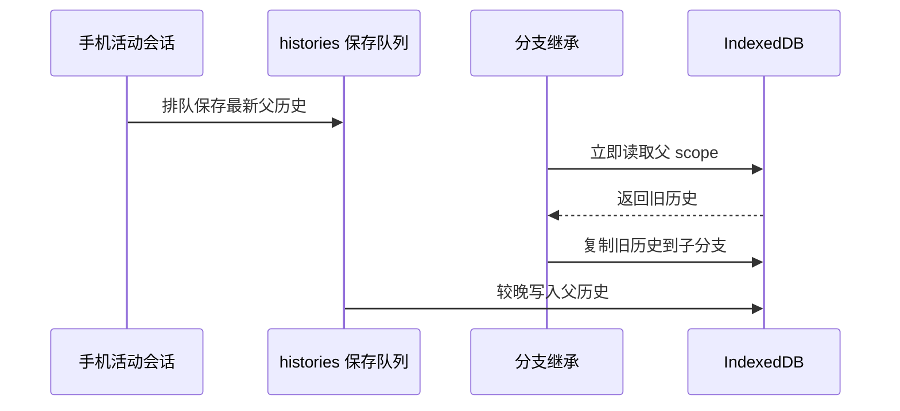
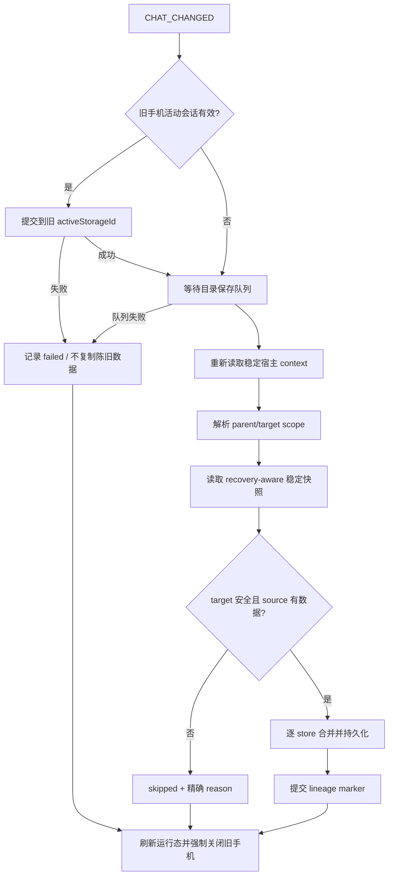

# 手机数据分支继承与重启持久化修复设计

## 1. 目标

修复两类用户可见故障：

1. 在 SillyTavern 点击创建/切换分支后，父聊天中的手机数据没有完整继承到新分支。
2. 手机数据当时可见，但隐藏页面、关闭或重启 SillyTavern 后偶发回退或丢失。

生产验收标准不是“多数时候能用”，而是：分支事务只能复制已确认落盘的父 scope；重启恢复不能让陈旧 IndexedDB 覆盖更新的本地紧急快照；失败必须可诊断、可重试，禁止写入伪成功 lineage。

## 2. 已确认的代码缺陷

### 2.1 分支前没有提交手机当前活动会话

`src/phone-host-events.js` 的 `CHAT_CHANGED` 监听直接启动 `beginBranchInheritance()`，结束后调用 `window.__pmEnd(true)`。强制关闭明确不会执行 `persistCurrentHistory()`。

而当前联系人/群聊的最新消息可能仍只在 `state.conversationHistory` 中，尚未进入 `window.__pmHistories` 与存储。因此分支事务即使成功，也可能复制父 scope 的旧快照。

### 2.2 分支来源读取没有等待异步保存队列

`persistConversationHistory()` 同步更新运行时历史后，只触发异步 `saveHistories()`。`loadProductionStores()` 随后直接读取 IndexedDB，没有等待 `histories` 目录队列完成。

于是存在确定竞态：



### 2.3 重启时旧 IndexedDB 会覆盖更新的卸载快照

`saveHistoriesBeforeUnload()` 先同步写 localStorage，再以 fire-and-forget 方式写 IndexedDB。浏览器可能在 IndexedDB 请求完成前终止页面。

重启时 `loadHistoriesFromIDB()` 只要发现 IndexedDB key 存在，就无条件采用 IndexedDB，并反向覆盖 localStorage。于是更新的卸载快照会被旧主记录抹掉。

## 3. 尚未证实、必须通过真实宿主分类的条件

以下是已有诊断分支，不伪装成已确认根因：

- `not-branch`：`CHAT_CHANGED` 时 `main_chat` 等分支元数据尚未稳定。
- `target-not-empty`：其他宿主监听器先为目标 scope 写入了默认/空对象，现有安全守卫因此拒绝继承。
- `source-empty`：父 scope 确实无数据，或最新活动会话尚未提交。
- `already-cloned`：lineage 已存在；需要确认该 marker 对应的数据是否真实完整。

第一轮实现不擅自放宽 `target-not-empty` 和 lineage 安全规则。只有真实宿主证据证明“自动生成的语义空占位”阻塞正常继承，才设计第二阶段的空占位分类；否则随意覆盖目标 scope 只是把数据损坏包装成修复。

## 4. 修复边界

### 4.1 允许修改

- `src/phone-host-events.js`
- `src/phone-foundation.js`
- `src/directory-save-coordinator.js`
- `src/branch-scope-inheritance.js`
- `src/storage-history.js`
- `src/storage.js`
- `scripts/check-behavior.mjs`
- 构建生成的 `index.js`

### 4.2 非目标

- 不修改手机历史主数据 `ST_SMS_DATA_V2` 的内容 schema。
- 不提升备份版本，不改变备份导入导出格式。
- 不修改分支 lineage schema/version。
- 不修改 UI、样式、聊天生成、世界书、社区或今日风向业务语义。
- 不自动覆盖任何已含真实用户数据的目标 scope。
- 不顺手处理当前工作区中 `phone-injection`、主题或今日风向的无关改动。

## 5. 设计方案

### 5.1 分支切换前严格提交旧活动会话

在 `CHAT_CHANGED` 回调内、解析并启动分支事务前增加 preflight：

1. 若手机未打开或没有有效的旧 `activeStorageId + saveKey`，跳过提交。
2. 若存在活动会话，调用已安装到 `deps` 的 `persistCurrentHistory()`。
3. 该函数必须继续使用 `state.activeStorageId`，而不是新的宿主 `getStorageId()`，保证写回父聊天 scope。
4. 返回 `false` 或抛错时，不允许继续复制陈旧来源；记录失败诊断后执行宿主切换清理。
5. 仍然使用 `__pmEnd(true)` 关闭旧窗口，避免在新宿主上下文下再次保存旧 UI snapshot。

不调用 `persistPhoneUiSnapshot()`。该状态依赖当前宿主 scope，切换后保存反而可能把父页面状态误写到子分支。

### 5.2 增加目录保存队列屏障

在 `directory-save-coordinator` 增加只读等待接口，例如：

```js
awaitDirectoryOperations(['histories', 'groupMeta', 'interactive', 'backgrounds', 'todayTrend'])
```

契约：

- 等待调用时已排队的操作完成。
- 不吞掉最近保存失败；失败必须阻止分支事务。
- 不修改 revision、branch scope 事件或持久化数据。
- 不在持有同一 store 队列的 commit 回调内递归等待，避免自锁。

`beginBranchInheritance()` 在首次 `loadProductionStores()` 前通过该屏障取得稳定来源快照。重点是 `histories`；其余异步目录 store 同时纳入，避免同一种竞态继续潜伏在背景、互动场景和今日风向中。

### 5.3 重启恢复 marker

新增仅用于运行时恢复的 localStorage key：

`ST_SMS_DATA_V2_RECOVERY_V1`

marker 只保存小型元数据，不复制聊天正文：

```text
version + token + localSnapshotFingerprint
```

它不是业务 schema，也不进入备份。

#### 卸载写入

1. 页面挂起前先调用 `deps.persistCurrentHistory?.()`，同步把活动会话合并到 `window.__pmHistories`。
2. `saveHistoriesBeforeUnload()` 将实际可写入的完整或 slim JSON 同步写入 localStorage。
3. 本地快照成功后写 recovery marker。
4. 异步写 IndexedDB；成功后只在 marker token 仍属于本次写入时清除 marker。
5. 较旧异步任务绝不能清除更新 marker。

#### 正常异步保存与卸载竞态

`saveHistoriesStrict()` 开始时记录当前 marker token。IndexedDB 成功后：

- marker 未变化：可以更新本地镜像并清除对应旧 marker。
- marker 在保存期间变成新 token：说明发生了更新的卸载快照；旧保存不得覆盖 localStorage，也不得清 marker。

这不是花哨的版本控制，而是阻止“旧异步完成得更晚”反向覆盖新数据的最低限度事务条件。

#### 启动恢复

`loadHistoriesFromIDB()` 与分支来源读取必须共享 recovery-aware 读取规则：

1. marker 有效且本地快照 fingerprint 匹配：优先使用本地快照。
2. 尝试将该快照修复写入 IndexedDB。
3. 修复成功且 marker 未变化后清 marker。
4. 修复失败则保留 marker，运行时仍使用已恢复数据，并给出不含聊天正文的警告。
5. marker 缺失时保持现有 IndexedDB-primary 兼容语义。
6. marker 损坏或本地快照无效时，不得删除 IndexedDB；回退主记录并输出可诊断警告。

marker key 加入 `PLUGIN_LOCAL_STORAGE_KEYS`，确保“清除插件数据”不会留下幽灵恢复状态。

### 5.4 事务顺序



lineage 只能在全部 store 保存成功后提交。lineage 失败继续使用现有补偿逻辑，删除本事务写入的目标 scope，并保留并发产生的无关数据。

## 6. 测试计划

在 `scripts/check-behavior.mjs` 增加以下可机器验证用例：

1. **分支前刷盘**：手机打开且父会话有未提交消息时，`persistCurrentHistory` 必须先于 `beginBranchInheritance`；目标复制最新内容。
2. **错误 scope 防护**：preflight 使用旧 `state.activeStorageId`，不得使用新宿主 storageId。
3. **提交失败阻断**：活动会话提交返回 false 或保存队列失败时，不得写目标 scope/lineage。
4. **队列屏障**：阻塞父历史保存后触发分支，继承不得提前读取；释放后目标必须得到最新父快照。
5. **恢复 marker**：IndexedDB 旧、本地新且 marker 有效时，启动必须恢复本地并修复 IndexedDB。
6. **无 marker 兼容**：继续采用 IndexedDB-primary，不改变历史用户数据读取规则。
7. **旧异步保护**：较旧 `saveHistoriesStrict` 晚完成时，不得覆盖更新的卸载快照或清除新 marker。
8. **slim 回退**：完整 localStorage 写入失败但 slim 成功时，marker 指向实际 slim 快照，重启可恢复。
9. **损坏 marker**：不得破坏有效 IndexedDB；必须降级并可诊断。
10. **清理契约**：`clearPluginData()` 删除 marker。
11. **lineage 顺序**：数据落盘前不得写 marker；失败补偿后 marker 不存在。

验证命令按顺序单独执行：

- `npm.cmd run check:behavior`
- `npm.cmd run build`
- `npm.cmd run check:syntax`
- `npm.cmd run check`
- `git diff --check`

全量门禁若被工作区既有无关改动阻断，必须给出断言归属和隔离证据，不得伪报全绿。

## 7. 真实 SillyTavern 验收矩阵

至少执行：

1. 父聊天打开手机，新增一条消息但不手动关闭手机，立即创建分支；子分支手机应继承该消息。
2. 父分支和子分支分别新增不同消息，互不污染。
3. 手机打开时切回父聊天，再切回子分支，数据保持隔离。
4. 创建分支后立即刷新页面，数据仍存在。
5. 创建分支后关闭并重启 SillyTavern，数据仍存在。
6. 页面隐藏后立即结束宿主，再启动，恢复最新历史。
7. 连续创建两个子分支，各自只继承创建时的父快照。
8. 查看 `__pmDiag.snapshot()`：结果必须是 `cloned`，或给出可解释的 `not-branch/source-empty/target-not-empty/already-cloned/failed`；诊断不得包含聊天正文。

若真实宿主稳定复现 `not-branch` 或由语义空占位造成的 `target-not-empty`，再提交第二阶段设计，不能在本轮凭猜测放宽数据安全守卫。

## 8. 兼容、迁移与回滚

- 不迁移 `ST_SMS_DATA_V2`、Phone UI、互动场景、日历、今日风向或 lineage 数据。
- 新 marker 对旧版本是无害的未知 localStorage key；旧版本仍可读取原历史数据。
- 回滚代码不会改变主数据格式；marker 可由插件清理流程删除。
- 回滚不得使用 `git reset --hard`，当前工作树含其他任务改动，必须按文件/差异精确回退。

## 9. 风险

- recovery marker 处理错误会制造新的读写优先级问题，因此 token 竞态测试是 blocking 门禁。
- 页面卸载无法保证异步 IndexedDB 完成；设计目标是保证同步本地快照可恢复，而不是假装浏览器会等待异步请求。
- 真实宿主事件顺序仍需验证；自动化 mock 只能证明本地事务契约，不能替代 SillyTavern 分支生命周期验收。
- 当前工作区已有无关未提交改动，实施必须严格限制文件并核对专项 diff，避免覆盖助手现有工作。

## 10. 自我复查

这版设计已经覆盖已证实的三条失效链：活动会话未提交、分支读取早于保存队列、旧 IndexedDB 覆盖卸载快照；也保留了 lineage、目标非空守卫和备份兼容。

不足也很明确：尚无真实 SillyTavern 现场的 `__pmDiag` 结果，因此 `not-branch` 和 `target-not-empty` 只能作为条件性第二阶段，不能在这一版擅自修改。能画出来不等于能落地；在真实宿主验收完成前，只能称“事务设计闭合”，不能宣称问题已修复。