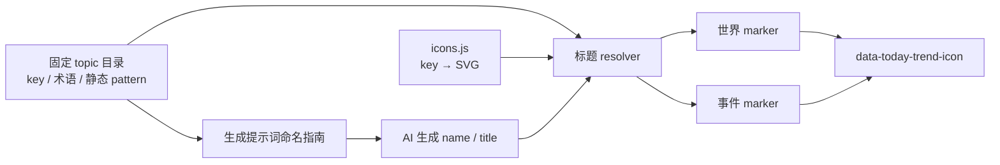

# 今日风向标题图标覆盖率收敛设计

## 1. 问题与证据

当前问题不是 SVG 资产量不足，而是资产利用率和标题命中率不足。

- `src/icons.js` 有 **64 个完整 SVG 常量**；另有 5 个关系状态 path。`assets/today-trend/` 的 12 个 SVG 是 faction/reputation 分层背景装饰，不应挪作 24×24 marker。
- 标题解析器只暴露 18 个结果 key：14 条标题规则，加 world/event 的 4 类回退（`src/today-trend-title-icon-mapping.js:9-45`）。
- 现有天气资产至少包含晴、晴间多云、云、雾、雪、雷暴与普通天气（`src/icons.js:30-36`），解析器却只区分 storm 与普通 weather。
- 生成提示词仅约束 `world.items[].name` 和 `event.title` 的 schema；初始化与增量提示词均未告知模型可映射的标题语义词汇（`src/prompts/today-trend/envelopes.js:18-23,49-52`）。
- 现有 fixture 已显示自然标题的覆盖缺口：`节目风向`、`后勤消息`、`观众情绪` 会落入世界默认；`晚餐服务`、`后厨协调` 会落入普通事件回退。相反，测试正例仅证明人为挑选的 14 类标题可命中，不能代表真实标题覆盖率。

因此，展示层的固定关键词表与生成端的自由命名互不知情；世界项目又没有 type 回退，默认地球图标会系统性聚集。

## 2. 目标

1. 用一个固定、代码内置、可审查的语义目录同时服务生成提示词和标题 resolver，消除两份词表漂移。
2. 把已有的细分天气资产用于标题映射，避免雪、雾、云、晴全部显示相同图标。
3. 让常见自然标题（风向、消息、观众、后厨等）进入明确、低歧义的语义类别，同时保留未知主题的诚实 fallback。
4. 保持映射为纯展示逻辑：旧存储标题重新渲染即可获得新图标，不迁移、不写回、不增加 `icon` 或 `iconKey`。
5. 为提示词注入、规则优先级、现有自然标题、细分天气和 fallback 建立可机器验证的契约。

## 3. 非目标与边界

- 不修改 `TODAY_TREND_VERSION`、schema、store、备份、导入导出、生成结果字段或分支继承。
- 不将图标分类持久化进世界项目、事件、快照或 prompt 结果 JSON。
- 不引入用户配置、动态正则、AI 返回分类字段、第三方图标包或运行时遥测。
- 不根据关键词改变颜色；SVG 继续使用 `currentColor`，marker 继续消费现有尺寸 token。
- 不把导航、编辑、删除等交互图标硬塞进内容语义目录；常量存在不等于适合内容 marker。
- 不保证所有标题都去除 fallback。无法安全归类的主题必须保持默认，不能为了视觉多样性误导语义。

## 4. 方案决策

采用 **共享语义目录 + 生成命名引导 + 纯展示 resolver**，而不是只无限扩张 resolver，也不是新增持久化分类字段。

### 4.1 为什么不是只扩关键词

只扩 resolver 可以短期降低 fallback，却会再次形成“模型随意命名、UI 被动猜测”的单向依赖；词表会持续膨胀，且无法证明生成的新标题会进入稳定语义桶。

### 4.2 为什么不新增 `iconKey`

`iconKey` 会进入持久化模型、备份、导入导出和跨版本兼容边界。这个需求只是展示分类，增加数据字段会制造迁移与陈旧值风险，完全不值得。

### 4.3 共享目录边界

新增纯数据模块，例如 `src/today-trend-title-icon-topics.js`：

```text
固定 topic 条目
  key          稳定内部 key
  label        面向 prompt 的中文语义名
  promptTerms  面向生成器的固定锚词列表
  pattern      静态 RegExp，供 resolver 使用
  priority     由数组顺序表达，禁止运行时重排
```

该模块不导入 SVG、不访问 store、不读 DOM、不修改输入对象。`src/today-trend-title-icon-mapping.js` 继续唯一拥有 `key → SVG` 目录与 fallback；prompt envelope 只读取可序列化的 `label/promptTerms` 生成命名指南。



## 5. 语义目录与优先级

目录必须固定为下列优先级；每类词语均为多字短语或领域词，不引入 `港`、`城`、`信`、`服务` 之类宽泛单字。

| 顺序 | key | 标题锚词范围（示例，不得脱离目录新增平行判断） | 图标来源 |
|---:|---|---|---|
| 1 | `weather-storm` | 雷暴、暴雨、台风、飓风、洪水、山火、地震、灾害 | `WEATHER_STORM_ICON_SVG` |
| 2 | `weather-snow` | 降雪、暴雪、积雪、冰冻 | `WEATHER_SNOW_ICON_SVG` |
| 3 | `weather-fog` | 大雾、浓雾、雾霾 | `WEATHER_FOG_ICON_SVG` |
| 4 | `weather-sun` | 晴天、艳阳、酷暑、高温、热浪 | `WEATHER_SUN_ICON_SVG` |
| 5 | `weather-partly-cloudy` | 少云、多云、晴间多云 | `WEATHER_PARTLY_CLOUDY_ICON_SVG` |
| 6 | `weather-cloud` | 阴天、阴云、云层 | `WEATHER_CLOUD_ICON_SVG` |
| 7 | `document` | 公告、通告、签署、协议、条约、法令、政策、通知、报告 | 既有 document SVG |
| 8 | `rumor` | 传闻、流言、谣言、爆料、辟谣 | 既有 rumor SVG |
| 9 | `signal` | 联络、通讯、信号、对接、协作、会谈、消息 | 既有 signal SVG |
| 10 | `calendar` | 日程、期限、会议、峰会、纪念、周年、倒计时 | `CALENDAR_ICON_SVG` |
| 11 | `live` | 直播、演出、开幕、发布会、展演、活动 | `LIVE_ICON_SVG` |
| 12 | `heart` | 恋情、恋爱、婚礼、分手、和解、告白 | `HEART_ICON_SVG` |
| 13 | `location` | 航线、路线、港口、机场、车站、城区、区域、地点、迁移 | 既有 location SVG |
| 14 | `community` | 观众、粉丝、社群、居民、协会、社区 | `COMMUNITY_ICON_SVG` |
| 15 | `weather` | 天气、降温、寒潮 | `WEATHER_ICON_SVG` |
| 16 | `trend` | 增长、下滑、复苏、转型、扩张、收缩、走势、趋势、风向 | `TREND_ICON_SVG` |
| 17 | `sparkles` | 发现、突破、研发、实验、新品、异象 | `SPARKLES_ICON_SVG` |
| 18 | `recipe` | 餐饮、美食、食谱、餐厅、菜单、晚餐、后厨、食材、烹饪 | `RECIPE_ICON_SVG` |
| 19 | `outfit` | 时装、服饰、穿搭、造型、秀场 | `OUTFIT_ICON_SVG` |
| 20 | `time` | 历史、旧案、溯源、年代、回顾 | `TIME_ORIGIN_ICON_SVG` |

说明：

- 原 `weather-storm > document > rumor > signal` 等冲突顺序保持；更具体的天气必须位于泛天气之前。
- `报告 → document` 的既有决策保持不变。
- `消息` 归 signal 是经过语义收敛后的新增词；它是双字词，表示信息传递，不以单字“信”误捕获无关标题。
- `观众情绪` 归 community、`节目风向` 归 trend、`后厨协调` / `晚餐服务` 归 recipe，分别解决当前 fixture 中已观察到的默认回退。
- `地下线`、`incident`、`normal` 仍只在事件标题未命中时按 type 兜底，不把 type 混入标题优先级。

## 6. 生成提示词契约

### 6.1 注入内容

初始化和增量 envelope 都加入相同的“标题命名与展示语义”段：

1. 只有当事实确属某一 topic 时，`world.items[].name` 或事件 `title` 应包含该类的一个锚词。
2. 标题必须自然、简洁、符合世界观；不得为了图标硬塞无关词。
3. 无合适 topic 时允许自由命名，UI 将显示默认图标；不把未分类主题视为生成错误。
4. 不输出 icon、iconKey、category 或任何 schema 外字段。

提示词指南由共享目录渲染，不在 envelope 中手写第二份关键词列表。为控制 token，目录只输出 `label：术语1、术语2…`，不输出 SVG、RegExp 源码、key 或 UI 实现细节。

### 6.2 兼容性

- 既有历史标题不会被改写；下一次渲染仅重新计算展示 icon。
- prompt 更新仅影响未来生成标题的措辞概率，不能作为数据校验或拒绝旧记录的依据。
- 增量生成仍遵守既有事件基础资料不可改写规则；名称/标题只会在创建或允许编辑的既有流程中改变，不因图标收敛而重命名历史事件。

## 7. 实施影响面

| 文件 | 变化职责 |
|---|---|
| `src/today-trend-title-icon-topics.js` | 新增固定语义目录与 prompt guide helper；无 SVG、无状态、副作用为零。 |
| `src/today-trend-title-icon-mapping.js` | 从共享目录消费固定 pattern；补齐 20 类 key 的 SVG catalog 与既有 fallback。 |
| `src/prompts/today-trend/envelopes.js` | 初始化、增量 prompt 注入共享命名指南；不改变输出 JSON schema。 |
| `src/icons.js` | 不重画、不替换既有图形；仅被 resolver 新增导入既有 weather/community 常量。 |
| `scripts/check-today-trend.mjs` | 增加目录/提示词/细分天气/自然标题/冲突与 fallback 契约。 |
| `scripts/check-contracts.mjs` | 若新增的结构或 SVG 约束可机器验证，则锁定；不机械改 CSS registry。 |
| `index.js` | 仅由 build 更新。 |

不改 world/dynamics view 的调用方式：它们继续只传 `item.name` 与 `event.title/type`，继续输出 `data-today-trend-icon` 和 `aria-hidden="true"`。

## 8. 验收与验证

### 8.1 行为契约

至少覆盖：

1. 20 类 topic 各有自然正例，且每个 key 有对应 SVG。
2. 细分天气：暴雪、大雾、晴天、多云、阴天、寒潮分别落到 snow/fog/sun/partly-cloudy/cloud/weather；灾害词仍优先 storm。
3. 已有冲突不回归：暴雨+航线、协议+港口、辟谣+发布会、联络+机场、趋势+报告。
4. 新自然样本：`节目风向 → trend`、`后勤消息 → signal`、`观众情绪 → community`、`晚餐服务 → recipe`、`后厨协调 → recipe`。
5. 标题命中永远优先于 `event.type`；事件 badge 行为不变。
6. summary、origin、latestStage、participants 含关键词仍不得改变图标。
7. 空、空白、未知标题仍走 `world-default` 或事件 type fallback。
8. 初始化和增量 envelope 都含同一份由目录生成的命名指南；不得出现 `icon`、`iconKey` 或 schema 新字段指令。
9. 目录 key、resolver SVG catalog、prompt guide 的 key 集必须完全一致；漏配或孤儿 key 均失败。

### 8.2 自动门禁

按现有 Windows 约束，单条执行：

1. `npm.cmd run build`
2. `npm.cmd run check:syntax`
3. `npm.cmd run check:today-trend`
4. `npm.cmd run check:contracts`
5. `npm.cmd run check`
6. `git diff --check`

### 8.3 真实宿主覆盖率采样

自动测试不能证明真实世界观标题分布。发布前在真实宿主的世界态势、活动事件、归档事件页面分别统计 `data-today-trend-icon` 的 key 数量；只采集 key 计数，不采集标题或聊天正文。

验收记录必须写明：

- `world-default`、`event-normal` 的计数与占比；
- 细分天气及新 community/trend/recipe/signal key 是否实际出现；
- 采样的页面范围和时间；
- 相比变更前是否改善。

没有变更前的真实基线时，不承诺任意虚构百分比；只报告实测分布。若默认仍占主导，应回到真实未命中标题列表增补受控 topic，不能凭感觉继续堆图标。

## 9. 风险、回滚与自审

| 风险 | 控制 |
|---|---|
| prompt 术语让标题变得机械 | 明确“事实相关才使用、不得为图标硬塞词”，并人工抽查生成标题。 |
| 词表扩大造成误命中 | 仅多字锚词；固定顺序；为每个新增词补负例与冲突例。 |
| 三份目录漂移 | 语义目录单一来源；测试比较 topic、SVG catalog 与 prompt guide key 集。 |
| 历史数据兼容 | 不写任何新字段，不重命名记录，无迁移。 |
| SVG 看起来仍相似 | 保留 `currentColor` 和既有尺寸 token；先用真实宿主验证细分天气的可辨识度。 |
| 默认仍多 | 不伪装为实现错误；以 key-only 采样收集真实未命中标题，再经设计评审扩展。 |

回滚不涉及数据：回退 prompt guide、语义目录、resolver catalog 和测试，重新 build 即可；旧 world/event 记录无需迁移或清理。

这套设计比上一版完整，但仍有一个不能粉饰的限制：它通过提示词提高未来标题的可映射概率，不能保证每个世界观都遵从固定语义。未知标题保留默认图标是正确行为；若为了降低默认比例而强行扩大宽泛关键词，最终只会把误分类伪装成多样性。