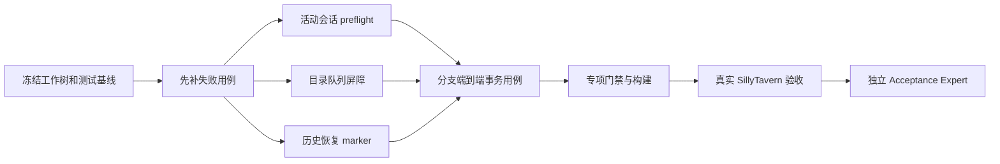

<!-- LIMCODE_SOURCE_ARTIFACT_START -->
{"type":"design","path":".limcode/design/phone-branch-inheritance-restart-persistence.md","contentHash":"sha256:8949d9052157a56cb7ae1c8af001d33fa8e13a0ba8e9c777f989e4d8a8287988"}
<!-- LIMCODE_SOURCE_ARTIFACT_END -->

## TODO LIST

<!-- LIMCODE_TODO_LIST_START -->
- [ ] 调用独立 Acceptance Expert 逐项核验，修复 blocking/major 后复验  `#branch-fix-acceptance`
- [x] 确认缺陷链、持久化边界、允许修改文件和既有无关工作区改动  `#branch-fix-baseline`
- [x] 运行专项行为检查、构建、语法检查和 diff 检查，并区分无关基线失败  `#branch-fix-gates`
- [ ] 在真实 SillyTavern 实例执行分支、刷新、关闭重启和连续分支验收矩阵并留存诊断快照  `#branch-fix-host-validation`
- [x] 修复并回归验证恢复标记写入失败时旧异步保存覆盖更新本地快照的竞态  `#branch-fix-marker-write-failure`
- [x] 在 CHAT_CHANGED 分支继承前提交旧活动会话，并保证失败不登记伪成功 lineage  `#branch-fix-preflight`
- [x] 为分支来源生产存储读取增加异步保存队列屏障  `#branch-fix-queue-barrier`
- [x] 实现卸载恢复标记，阻止重启时旧 IndexedDB 覆盖更新本地快照  `#branch-fix-recovery-marker`
- [x] 补充父子分支、连续分支、失败隔离及重启恢复生产链路回归测试  `#branch-fix-regression-tests`
<!-- LIMCODE_TODO_LIST_END -->

# 手机数据分支继承与重启持久化修复实施计划

## 1. 计划来源

- **确认设计**：`.limcode/design/phone-branch-inheritance-restart-persistence.md`
- **需求来源**：助手反馈“手机数据点击酒馆分支后没有继承，且有时重启酒馆丢失数据”。
- **实施性质**：既有持久化与分支事务缺陷修复，不新增产品功能，不重做手机数据系统。

本计划只落实设计中已证实的三条失效链：

1. `CHAT_CHANGED` 启动分支继承前，当前手机活动会话没有提交到父聊天 scope。
2. 分支来源快照直接读取 IndexedDB，没有等待已经排队的异步保存。
3. 页面卸载后的更新 localStorage 快照可能尚未写入 IndexedDB；重启时陈旧 IndexedDB 又会覆盖更新快照。

`not-branch`、`target-not-empty` 等宿主现场条件只作为诊断分类，不在没有真实证据时放宽安全守卫。

## 2. 目标与验收边界

### 2.1 必须实现

- 手机打开时创建/切换分支，当前联系人或群聊的最新历史先提交到**旧 `state.activeStorageId`**，再读取父 scope 并复制。
- 分支来源读取必须发生在调用时已排队的相关目录保存之后。
- 页面隐藏、关闭或重启导致异步 IndexedDB 写入未完成时，启动仍能识别并恢复更新的本地历史快照。
- 分支数据全部保存成功后才允许提交 lineage；失败路径不得残留伪成功 marker。
- 父聊天、子分支及连续创建的多个子分支保持数据隔离。

### 2.2 严格不改

- 不修改 `ST_SMS_DATA_V2` 内容 schema。
- 不提升备份 schema/version，不改变备份导入导出字段。
- 不修改 `ST_SMS_BRANCH_LINEAGE_V1` 的 entry schema/version。
- 不覆盖含真实数据的目标 scope，不删除 `target-not-empty` 守卫。
- 不修改 UI/CSS、AI 生成、世界书、社区、日历或今日风向业务语义。
- 不处理工作树中 `src/phone-injection.js`、`scripts/check-permissions.mjs`、主题、今日风向及 `.limcode` 其他任务的无关改动。

## 3. 影响文件与职责

| 文件 | 计划修改 | 边界 |
| --- | --- | --- |
| `src/phone-host-events.js` | 编排 `CHAT_CHANGED` 的旧会话 preflight、分支事务、诊断和清理顺序 | 不改宿主事件注册键和其他消息事件语义 |
| `src/phone-foundation.js` | 页面挂起时先尝试把活动历史提交进运行时仓库，再执行同步卸载快照 | 不在宿主已切换后保存 Phone UI snapshot |
| `src/directory-save-coordinator.js` | 增加只读队列等待接口 | 不改变 revision、branch scope event 和现有串行队列语义 |
| `src/branch-scope-inheritance.js` | 在生产来源首次读取前等待相关保存队列，并复用 recovery-aware 历史读取 | 不放宽来源/目标/lineage 安全判断 |
| `src/storage-history.js` | 实现恢复 marker、token/fingerprint 校验、启动修复和旧异步保护 | 不改变主历史对象格式，不把聊天正文写进 marker |
| `src/storage.js` | 导出恢复所需契约并把 marker 纳入插件 localStorage 清理清单 | marker 不进入备份 schema |
| `scripts/check-behavior.mjs` | 增加事务顺序、竞态、兼容和清理回归断言 | fixture 只围绕本模块，不借用无关配置 |
| `index.js` | 由 `npm.cmd run build` 生成 | 禁止手改 bundle |

## 4. 实施顺序与阻塞关系

- **C、D、E 的实现可以在边界清晰后并行，但合并验证必须串行。**
- **真实宿主验证依赖构建产物完成。**
- **独立验收依赖专项 diff、运行命令 exit 结果和真实宿主结果；缺证据不能冒充通过。**

## 5. 分阶段实施任务

### 阶段 A：冻结实施基线和可分离范围

**操作：**

1. 记录 `git status --short --branch`，确认当前无关修改及未跟踪文件。
2. 读取允许修改文件的最新内容和相关调用方；尤其确认 `deps.persistCurrentHistory` 的安装顺序、`state.activeStorageId` 生命周期、目录队列调用点、历史清理键和测试存储 mock。
3. 记录专项开始前以下文件的 diff 状态：
   - `src/phone-host-events.js`
   - `src/phone-foundation.js`
   - `src/directory-save-coordinator.js`
   - `src/branch-scope-inheritance.js`
   - `src/storage-history.js`
   - `src/storage.js`
   - `scripts/check-behavior.mjs`
   - `index.js`
4. 若这些文件已有不属于本专项的修改，停止盲写，先划分 hunk 所有权；不得覆盖助手现有工作。

**验收：** 专项允许文件、无关改动和构建产物边界有明确记录，后续 diff 可以按 hunk 审查和回退。

### 阶段 B：先固定失败契约

在实现前为已证实的失效时序补充失败用例，避免写完代码再用“测试配合实现”的方式自我欺骗。

**新增断言：**

1. `CHAT_CHANGED` 中活动历史提交发生在 `beginBranchInheritance` 前。
2. 提交参数使用旧 `state.activeStorageId` 和当前 save key；新宿主 storageId 不得成为父历史写入目标。
3. 活动会话提交失败或抛错时，继承入口不被调用，lineage 不写入；聊天切换资源清理仍只执行一次。
4. 已排队的父历史保存被阻塞时，分支来源不得提前读取；释放后子 scope 得到新快照。
5. IndexedDB 旧、本地新且存在有效 recovery marker 时，启动采用本地新快照并尝试修复 IndexedDB。
6. marker 缺失时保留现有 IndexedDB-primary 行为。
7. 较旧异步保存晚完成时，不得覆盖更新 localStorage 快照或清除更新 marker。
8. 完整 localStorage 写入失败而 slim 写入成功时，marker 必须对应实际写入的 slim 快照。
9. marker 损坏时不得删除或覆盖有效 IndexedDB。
10. `clearPluginData()` 删除 recovery marker。

**验收：** 未实现修复前，新增测试至少在对应缺陷点失败，而不是由于 fixture 拼错或无关断言失败。

### 阶段 C：分支切换前提交旧活动会话

**修改点：** `src/phone-host-events.js`

1. 把 `CHAT_CHANGED` 处理拆成清晰的异步顺序：
   - 捕获旧手机会话地址与活动状态；
   - 若地址有效，调用 `deps.persistCurrentHistory()`；
   - 等待目录保存屏障；
   - 重新读取宿主 context；
   - 调用 `beginBranchInheritance()`；
   - 记录结果或错误；
   - `finally` 中执行一次 `handleHostChatChanged()`。
2. preflight 只在手机活动且 `activeStorageId`、当前联系人/群聊 key 有效时执行。
3. `persistCurrentHistory()` 返回 `false` 或抛异常均视为不能确认父数据完整：记录 `failed`，阻断分支复制。
4. 保持 `window.__pmEnd(true)`，防止在宿主已切换到子分支后把父窗口状态再次写入错误 scope。
5. 不调用 `persistPhoneUiSnapshot()`；现有“强制关闭不保存旧 UI snapshot”契约继续成立。

**验收：** 子分支读取发生前，最新活动历史已进入父 scope；失败时没有目标写入或 lineage，清理动作恰好一次。

### 阶段 D：增加目录保存队列屏障

**修改点：** `src/directory-save-coordinator.js`、`src/branch-scope-inheritance.js`

1. 新增只读等待函数，接受显式 store 数组并验证 store 名称。
2. 等待调用时各 store 当前队列快照；不能使用 `.catch(() => {})` 吞掉保存失败。
3. 不递增 revision，不写 branch scope events，不创建保存 snapshot。
4. 在生产分支首次 `loadProductionStores()` 前等待：
   - `histories`
   - `groupMeta`
   - `interactive`
   - `backgrounds`
   - `todayTrend`
5. 屏障只能放在尚未进入各 store commit queue 的外层入口；`commitDirectoryScope()` 等队列回调内禁止等待自身队列，防止死锁。
6. 补偿阶段继续使用现有逐 store 协调逻辑，不重新套来源屏障。

**验收：** 阻塞 histories 保存时分支事务保持 pending；释放后复制最新父历史；保存失败直接进入可诊断失败路径，目标和 lineage 均未提交。

### 阶段 E：实现卸载恢复 marker 与启动修复

**修改点：** `src/storage-history.js`、`src/storage.js`、`src/phone-foundation.js`，必要时 `src/branch-scope-inheritance.js`

#### E1. 定义 marker 契约

- key：`ST_SMS_DATA_V2_RECOVERY_V1`
- 内容仅包含版本、唯一 token 和本地快照 fingerprint。
- fingerprint 必须可同步计算、稳定且不把正文写入 marker；它用于确认 marker 与 `ST_SMS_DATA_V2` 当前 localStorage 值匹配，不作为安全哈希。
- marker 解析必须校验对象形状、版本和字段类型。

#### E2. 页面挂起顺序

1. `handlePhonePageSuspension()` 先尝试 `deps.persistCurrentHistory?.()`。
2. 无活动会话或返回 `false` 时继续执行 `saveHistoriesBeforeUnload()`；只有抛异常需要输出不含正文的错误类型。
3. 然后执行现有社区、日历、今日风向取消和自动任务解除。

#### E3. 同步卸载快照

1. 尝试把完整历史 JSON 写入 localStorage。
2. 空间不足时按现有规则写最后 10 条的 slim 快照。
3. 仅在某个本地快照真实写入成功后创建 marker，fingerprint 对应实际写入字符串。
4. 异步写 IndexedDB 使用该次 token；成功后只有当前 marker token 未变化且 fingerprint 仍匹配时才清 marker。
5. IndexedDB 失败保留 marker，供下次启动恢复。

#### E4. 正常保存的旧异步保护

1. `saveHistoriesStrict()` 开始时读取 marker token/状态。
2. IndexedDB 写入成功后，写 localStorage 前重新读取 marker。
3. 若保存期间出现更新 marker，说明卸载路径写入了更新快照：旧保存不得覆盖 localStorage，不得清 marker。
4. marker 未变化时保持现有 IDB + local 镜像语义；仅清理由本次已确认持久化覆盖的 marker。

#### E5. 启动恢复

1. marker 有效且 localStorage 历史 fingerprint 匹配时，优先解析本地快照并写入 `window.__pmHistories`。
2. 尝试把该快照修复写入 IndexedDB。
3. 仅在修复成功、marker token 未变化且 fingerprint 仍匹配时清 marker。
4. 修复失败时保持运行时恢复结果和 marker，输出不含正文的警告。
5. marker 缺失时继续使用现有 IndexedDB-primary 路径。
6. marker 无效或与本地快照不匹配时，不得用不可信本地内容覆盖有效 IndexedDB；输出诊断后走主记录。
7. 分支来源历史读取复用同一 recovery-aware 规则，避免启动尚未修复时分支又读取旧主记录。

#### E6. 清理边界

把 marker 加入 `PLUGIN_LOCAL_STORAGE_KEYS`；不加入备份 capture/apply/validate，也不提升版本。

**验收：** 更新卸载快照不会再被旧 IndexedDB 或旧异步保存覆盖；无 marker 用户保持原读取行为；清除插件数据后 marker 不残留。

### 阶段 F：组合回归和错误路径

补齐端到端组合测试：

1. 手机活动会话含未提交消息 → 触发官方 `CHAT_CHANGED` → preflight → 队列屏障 → 分支 clone → lineage → force close。
2. preflight 失败、队列失败、store 保存失败、lineage 失败四条路径均验证：
   - 诊断状态准确；
   - 不泄露聊天正文；
   - 没有伪成功 marker；
   - 补偿不覆盖无关并发写入；
   - 资源清理一次且只一次。
3. 父/子 scope 之后分别保存不同消息，确认互不污染。
4. 连续两个目标分支使用各自创建时的父快照，不共享后续子分支写入。

**验收：** 测试能够分别在移除 preflight、屏障、marker token 保护或 recovery-aware 读取时失败，证明不是只覆盖快乐路径。

## 6. 自动验证与构建

命令必须逐条单独执行并保存本轮 exit 结果：

1. `npm.cmd run check:behavior`
2. `npm.cmd run build`
3. `npm.cmd run check:syntax`
4. `npm.cmd run check`
5. `git diff --check`

之后核对：

- `index.js` 包含 preflight、队列屏障和 recovery marker 逻辑。
- 构建未移除或覆盖工作区现有无关源码修改。
- 专项 diff 只涉及计划允许文件及 bundle 中相应生成变化。
- 全量门禁失败时定位首个断言及所属文件，区分本轮回归和既有无关改动；不能把既有通过记录冒充本轮证据。

## 7. 真实 SillyTavern 验收

在真实宿主执行并留存结果：

1. 父聊天打开手机，新增消息后不关闭手机，立即创建分支；子分支继承该消息。
2. 父和子分别新增不同消息，切换后互不污染。
3. 创建分支后立即刷新，子分支数据仍存在。
4. 创建分支后关闭并重启 SillyTavern，数据仍存在。
5. 页面隐藏后立即结束宿主，再启动时恢复最新历史。
6. 连续创建两个子分支，分别继承创建时父快照。
7. 手机未打开时创建分支，既有持久化父数据仍正常继承。
8. `__pmDiag.snapshot()` 不包含聊天正文；结果为 `cloned` 或可解释的精确失败/跳过原因。

若稳定出现：

- `not-branch`：记录 `CHAT_CHANGED` 当时安全字段的存在性与事件次序，再决定是否增加有限重试；
- `target-not-empty`：先确认占位对象是否语义为空及由谁写入，再单独修订设计；
- `already-cloned` 但目标数据缺失：阻断交付并调查 marker/数据原子性，不允许强制覆盖蒙混过关。

## 8. 独立验收门禁

调用 Acceptance Expert，提供：

- 已确认设计和本计划路径；
- 专项 diff 与 diff stat；
- 五条验证命令的本轮输出/exit；
- 真实宿主矩阵结果或明确缺失项；
- 当前工作树无关改动清单。

验收重点：

1. 数据丢失三条根因是否均被闭合。
2. marker 竞态是否可能让旧任务覆盖新快照。
3. 主 schema、备份和 lineage 兼容是否保持。
4. 目标非空守卫是否仍保护真实数据。
5. 错误路径是否可重试且不写伪成功状态。
6. 专项改动是否与工作树其他任务可分离。

存在 blocking/major 时修复并复验；未通过不得把 TODO 标为完成。

## 9. 回滚策略

按功能块精确回滚，不使用 `git reset --hard`：

1. **宿主 preflight 回滚**：只逆向 `phone-host-events` / `phone-foundation` 的顺序改动和对应测试。
2. **队列屏障回滚**：移除等待接口及 `beginBranchInheritance` 外层调用；保留原目录队列实现。
3. **recovery marker 回滚**：移除 marker 读写和清理键；主 `ST_SMS_DATA_V2` 数据无需迁移或转换。
4. **构建产物回滚**：重新基于回滚后的源码执行 build，禁止手工裁剪 `index.js`。
5. marker 即使在代码回滚后残留，也不会改变旧版主历史读取；可由插件清理或精确删除该单一 key。

## 10. 计划自检

这份计划已经把根因、调用顺序、持久化边界、竞态、兼容、测试、真实宿主和回滚拆成可执行阶段，且没有把 `target-not-empty` 的安全守卫当成碍事代码删掉。

但限制仍然存在：自动测试无法证明 SillyTavern 在所有版本中都以同一时序提供 `main_chat`。所以真实宿主矩阵不是装饰项；缺少它时，最多只能证明本地事务闭合，不能宣布生产问题完全解决。
